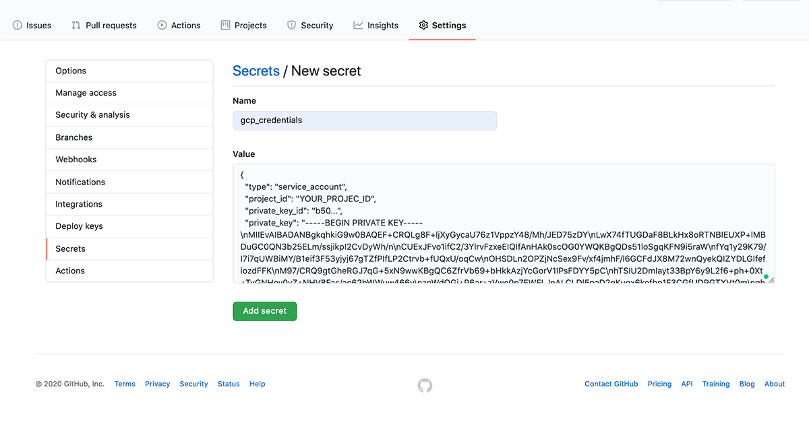

Google App Engine (GAE) is a nice and simple way to deploy your project. You can get up and running pretty quickly by using standard Node.js runtime. It comes with reasonable default settings, so you won't need a lot of configuration to get started.

In this post, I will show you step by step how to quickly deploy a Node.js application to Google App Engine.

We’ll also set up a continuous deployment workflow using Github Actions to automate our Google App Engine deployment.

You can find all the code presented here as an example Node.js project on [this Github repository](https://github.com/ognus/google-app-engine-node-deploy-example).

## Cost

Free! You wouldn't generally pay anything for hosting smaller projects on Google App Engine. Both Google Cloud Platform and Github have free tiers:

- Google App Engine comes with free 28 instance hours per day (instances scale to 0 when not used) and 1 GB of outgoing traffic per month.
- Github Actions are free for public repositories and come with 2,000 Actions minutes a month for all your private repositories.

## Prerequisites

To get started, make sure you have a Google account 😉.

Also, you'll need to install the `gcloud` SDK and create a project in the Google Cloud Platform.

You can follow the [Cloud SDK docs](https://cloud.google.com/sdk/docs/quickstarts) for detailed information on how to install and set up the SDK.

Generally is as simple as installing it and then running `gcloud init` in the terminal. It will walk your through authenticating to your Google account and setting up a project.

If you have already done it before and would like to create a new project you can call:

```bash
gcloud projects create [YOUR_PROJECT_NAME]
```

For more details see the [official docs on creating and managing projects](https://cloud.google.com/resource-manager/docs/creating-managing-projects).

## Node.js app

Before we can do any deployments, we need to have a Node.js app. Let’s quickly create a very simple one.

Our example Node.js app will have the following directory structure:

```bash
├── node_modules
│   └── ...
├── index.js
└── package.json
```

We’ll use the Express.js web application framework for convenience and for our example app to have at least one dependency.

The app will have just a single status endpoint. This is all we need to check if the deployment went well and the app is successfully running on Google App Engine.

Let’s have a look at the main `index.js` file.

### index.js

Since it’s a very simple app, we’ll define everything in a single `index.js` file.

```javascript
// index.js

const express = require("express");

const app = express();
const port = process.env.PORT || 8080;

app.get("/", async (req, res) => {
  res.json({ status: "OK" });
});

app.listen(port, () => {
  console.log(`App listening on port ${PORT}`);
});
```

The app runs a web server that will respond with `{ status: “OK” }` for all HTTP requests to the root `/` path.

The web server listens at a port number specified in the `PORT` environmental variable. Google App Engine will set this value for you.

### project.json

While deploying to Google App Engine, the build process will run the `npm install` to install all the app’s dependencies.

It will then call `npm start`. You just need to make sure your `package.json` contains a `start` script that will run the webserver.

Google App Engine will use `yarn` instead of `npm` if a `yarn.lock` file is available in the root directory.

Basic `package.json` file in our case would look like this:

```json
# project.json

{
  "name": "google-app-engine-node-deploy-example",
  "scripts": {
    "start": "node index.js"
  },
  "dependencies": {
    "express": "^4.17.1"
  }
}
```

This basically defines our example Node.js app. Let’s have a look at how we can deploy it to Google App Engine.

## The app.yaml file

To deploy our Node.js app to Google App Engine we need to create an `app.yaml` file in the project’s root directory:

```bash
├── node_modules
│   └── ...
├── app.yaml
├── index.js
└── package.json
```

The `app.yaml` file needs to at least specify the runtime. We are working with Node.js so a minimal file might look something like this:

```yaml
# app.yaml

runtime: nodejs12
```

The `app.yaml` file is a required config file for deploying to Google App Engine. Besides specifying the runtime (NodeJS, Java, Ruby, etc.), it's also a place to set additional App Engine options and environmental variables your app uses, like auto-scaling options or Database access details. This is a file you'd need to commit to your Github repository, so make sure you don’t include any sensitive data like passwords or API keys.

## Run the deployment

Now, you can kick off the deployment just by executing deploy command:

```bash
gcloud app deploy
```

This command will run a build and deployment process for the Node.js runtime, which runs a fresh install of the dependencies with `npm install` and starts the app (`npm start`).

## View the app

You can view the app by calling:

```bash
gcloud app browse
```

It will open the app URL in your default browser. The URL will look like this:
`https://PROJECT_ID.REGION_ID.r.appspot.com`

You can also print out the application logs:

```bash
# all logs
gcloud app logs tail

# just errors
gcloud app logs tail --level=error
```

That’s it. Pretty simple right? Besides setting up a Google Cloud Platform project, it was as simple as adding an `app.yaml` file to the project’s directory.

Let’s have a look if we can quickly set up a continuous deployment workflow. So we don’t have to manually deploy our app using the `gcloud app deploy` command.

## Continuous deployment using Github Actions

There are so many possibilities to set up continuous deployment for Google App Engine. We can basically use anything that allows `gcloud` SDK to be installed, so we can call `gcloud app deploy`.

One way you can do it effectively is via Github Actions. It's a fairly new, Github's own CI/CD solution. I like it, because you can build, test and deploy projects directly from Github with minimal configuration.

We’ll also leverage existing Google App Engine deployment Action that is available on Google's [deploy-appengine repository](https://github.com/google-github-actions/deploy-appengine).

Let’s start by adding a Github Actions workflow file `.github/workflows/deploy.yaml` to the project. It specifies the deployment job details:

```yaml
# .github/workflows/deploy.yaml

name: Deploy to Google App Engine
on:
  push:
    branches:
      - master
jobs:
  build:
    name: GAE Deploy
    runs-on: ubuntu-latest
    steps:
      - uses: actions/checkout@v2
      - uses: google-github-actions/deploy-appengine@main
        with:
          credentials: ${{ secrets.gcp_credentials }}
```

To get it working we need to create the `gcp_credentials` secret, which will contain our GCP project credentials in the form of a service account key. Otherwise, Github Actions won’t be able to make an authenticated `gcloud app deploy` call.

We’ll use the default Google App Engine service account `PROJECT_ID@appspot.gserviceaccount.com` to create the service account key.

To create the key we can simply run:

```bash
gcloud iam service-accounts keys create secret.json \
       --iam-account PROJECT_ID@appspot.gserviceaccount.com
```

This will save the key as the `secret.json` file. Make sure to NOT commit this file to the repo.

The last thing to do is to create a new secret in the Github repository. You can do that by going to _Settings > Secrets > New secret_. Then, naming the secret as `gcp_credentials` and passing the content of the `secret.json` file as value:



Done 🎉

Now, each time we commit to the master branch, the Github Actions workflow we’ve added would deploy the app to Google App Engine.

Hope you found this post helpful. Let me know where you like to deploy your Node.js applications. Have you tried Github Actions yet? I'm keen to know what is your favourite CI/CD solution.
