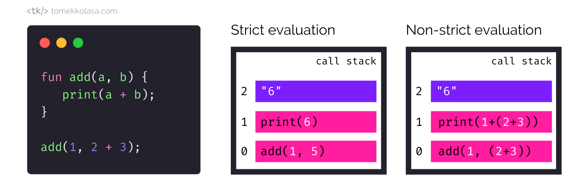
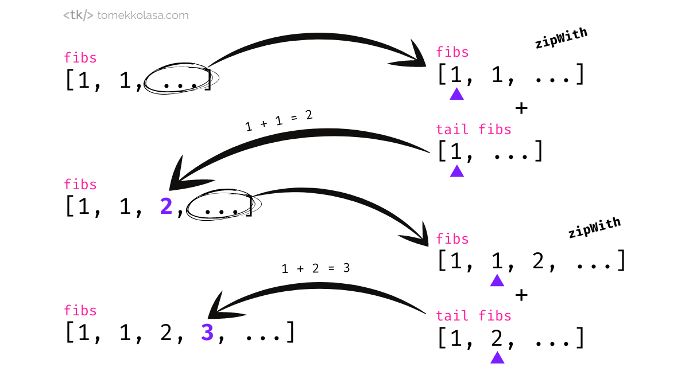

This article is about how programming languages evaluate expressions. It explains different evaluation strategies that various languages implement and shows where JavaScript fits into all of this.

You might have heard that JavaScript passes arguments by value and objects by reference, but does it really? This is one of the questions I will answer in the article.

So what is this **evaluation strategy**? Well, generally speaking it is a set of rules a programming language follows when evaluating an expression like `var x = 1, y = 2; x + y;` into another expression, in this case value `3`. It is especially interesting when evaluating functions.
Anything that happens with arguments during a function call is part of the evaluation strategy. It defines **when** and in **what order** the arguments are evaluated as well as what they are evaluated into, namely a **value or a reference**.

In practice, we can think of two such strategies. One is to completely evaluate the arguments' expressions before the function itself gets applied, which is called a **strict evaluation**. The other strategy is to not evaluate the arguments' expressions until they are actually used in the function body. This one is called (who would have guessed) a **non-strict evaluation**.



JavaScript, like most modern languages, uses a strict evaluation strategy and it passes arguments by value. But let's not get ahead of ourselves too much just yet. Let’s start by looking deeper into different types of strict evaluation strategies first.

## Strict evaluation

A strict or "eager" evaluation strategy means that all function's arguments are completely evaluated before the function is applied. The vast majority of languages use this strategy.

Strict evaluation comes in two flavors:

- pass by value (or call by value), and
- pass by reference (or call by reference).

### Pass by value

In the pass-by-value evaluation strategy, the argument is evaluated into a value. In other words, the value passed by a function caller as an argument gets copied and made available to the function. This is a de facto copy, so its value is stored in a different memory address. Since it's a copy, **all the modifications done to the argument's value by the function will not be visible to the caller**.

Just like in the JavaScript example below, the value of variable `age` resides in a different place in memory than the value of argument `x`. Even when we modify the argument `x` the value of `age` remains the same.

```javascript
function inc(x) {
  x = x + 1;
  return x;
}

let age = 25;
let older = inc(age);
console.log(older);
// 26
console.log(age);
// 25
```

### Pass by reference

Pass by reference evaluation strategy, on the other hand, allows the caller to pass an expression that gets evaluated to a reference instead of a value. This means that there are no copies being made, instead, the argument contains a reference that points to where the passed value is located in the memory.

Let's have a look at the example in C++, which is one of the languages that support pass-by-reference evaluation strategy. Just like in the JavaScript example above the `inc()` function modifies the value of the `x` argument. However, this time, the change is visible for the calling code and the value of `age` itself gets modified.

```cpp
#include <cstdio>

void inc(int& x) {
  x = x + 1;
}

int main() {
  int age = 25;

  inc(age);

  printf("%d", age);
  // 26
  return 0;
}
```

#### Is JavaScript a pass-by-reference or pass-by-value language?

The above pass-by-reference semantics are not available in JavaScript. JavaScript and many other languages like Java, Python, or Ruby use the pass-by-value evaluation strategy only. This is why JavaScript can be referred to as a pass-by-value language.

Interestingly enough you can read about JavaScript passing primitives (like numbers and strings) by value, but objects by reference in various online sources. This is not completely wrong, in the sense that it's a usable mental model to have when writing code in JavaScript. However, referring to objects being passed by reference is technically incorrect as the argument value is always copied. The primitive value is copied and the reference (to an object) is copied. In other words, **passing a reference is not the same as passing by reference**. In the pass-by-value evaluation strategy, if we pass in a reference, we get the value of the reference. In pass-by-reference on the other hand, if we pass in a reference, we get a reference to a reference. This is not possible in JavaScript and referring to the object as being passed by referance in JavaScript may breed ambiguity and confusion when comparing it to other programming languages. Especially languages like C++ or C# that indeed support pass-by-reference evaluation.

Does the lack of pass-by-reference make JavaScript a worse language? Not really, if anything one could argue that using pass-by-reference only adds confusion as it's not clear from the caller's perspective if the function might modify the arguments or not. Even if a language supports it, it's better to not overuse it. In fact, just like JavaScript, many modern languages do not support pass-by-reference. If your function needs to modify multiple values return an object or an array and reassign the variables. Even a neat trick of swapping variables that can be done so easily in pass-by-reference languages like C++ can usually be done quite elegantly in pass-by-value languages. For example by using arrays and destructuring in JavaScript:

```javascript
let x = 1;
let y = 2;

[x, y] = [y, x];
// x’s value is now 2, y is 1
```

### Call by sharing

The fact that JavaScript passes a reference value automatically if the argument is an object is sometimes referred to as **call-by-sharing**.

This term is not as widely used as pass-by-value and pass-by-reference but exists to differentiate an edge-case scenario that apparently does not fit well to either pass-by-value or pass-by-reference. Specifically, call-by-sharing is not exactly a pass-by-value because the called function is able to mutate the argument in a way that's visible to the caller. It's also not exactly a pass-by-reference because the function doesn't have the access to the caller's variables, just to resolved objects.

In my opinion, such a term is not useful and a distinction between "passing a reference as a value" and "passing a value by reference" explains this better. Furthermore, the call-by-sharing term is used inconsistently across programming languages. For example, in Python call-by-sharing is used both in official documentation and by the community, but many languages like Java, Ruby, or JavaScript don't use it at all, even though all of these languages use the same semantic of pass-by-value.

## Non-strict evaluation

Non-strict evaluation doesn't evaluate the expression immediately, but only when it's actually used. There are few variants of non-strict evaluation strategies being used by programming languages:

- call by macro expansion
- call by name
- call by need (lazy evaluation)

### Call by macro expansion

The simplest (and also the most generic and powerful) example of non-strict evaluation is the call-by-macro-expansion. For example, in C you can define a named block of code, a macro, that you can use in other parts of your code. Macro usage is similar to function invocation, but contrary to a function macro is not executable (it doesn't exist in a running program) but its contents are used for a simple textual ‘find and replace’ done by the C preprocessor. Much like copy and paste, just automated. This may lead to unintended variable name collisions and shadowing if a programmer is not careful. This is why some languages (like Rust) and dev communities focus on less-powerful but safer ways of creating macros, referred as hygienic macros.

### Call by name

Macros are a powerful and useful mechanism but let's focus on the evaluation of function arguments. As we already know, the non-strict evaluation does not evaluate arguments immediately. Instead, the expression from the argument gets substituted into the function's body. Much like the macros.

It's not a simple textual replacement, however, but rather a capture-avoiding substitution. By using capture-avoiding substitution we can be sure that the expressions we've replaced our arguments with do not cause any variable naming collisions.

<Block
  cite={
    <a href="https://en.wikipedia.org/wiki/Lambda_calculus#Capture-avoiding_substitutions">
      Wikipedia
    </a>
  }
>
  <strong>Definition:</strong> In Lambda calculus, capture-avoiding
  substitutions are substitutions that avoid accidentally capturing (or binding)
  previously free variables.
</Block>

Functional languages use this safe, capture-avoiding substitution to implement the call-by-name and call-by-need evaluation strategies. Call-by-name and call-by-need allow for an argument's expression to be evaluated only when it's actually used.

### Call by need

Call by need, also known as lazy evaluation is similar to the call-by-name strategy, but it uses memoization to avoid unnecessary evaluation. It only evaluates the argument's expression once, even if it's used in the function's body multiple times. Call-by-name on the other hand evaluates the expression each time.

<Block cite={<a href="https://en.wikipedia.org/wiki/Memoization">Wikipedia</a>}>
  <strong>Definition:</strong> Memoization is an optimization technique used to
  speed up programs by storing the results of expensive function calls and
  returning the cached result when the same inputs occur again.
</Block>

Let's have a look at a basic comparison of JavaScript's strict, pass-by-value evaluation and Haskell's non-strict call-by-name evaluation.

I've defined an `inc(x, y)` function that returns a sum of `x` and `y` if `x` is greater than `0`, and the `x` value increased by `1` otherwise. Let’s try to call it with values `1` and `2` as arguments `x` and `y`.

```javascript
function inc(x, y) {
  return x > 0 ? x + y : x + 1;
}

inc(1, 2); // 3
inc(0, undefined[0]);
// TypeError: Cannot read property '0' of undefined
```

No surprises here, as the `inc(1, 2)` call returns `3`. Also, no surprise that making an oopsie like accessing the first element of an "non-existing" array throws an error. Since JavaScript uses the strict evaluation strategy the expression `undefined[0]` is evaluated immediately and the `inc()` is not even called.

Ok, so let's try a very similar example in Haskell:

```haskell
inc x y =
  if x > 0 then x + y else x + 1

main = do
  print (inc 1 2) -- prints 3
  print (inc 0 (3 `div` 0)) -- prints 1, no error
```

Same as in JavaScript, a simple call like `inc 1 2` returns `3`. But what about the next line? We're actually making a very well-known oopsie here, with `` 3 `div` 0 `` we're trying to divide by zero (the `div` function performs an integer division in Haskell). However, the code works just fine! What's going on here?

Well... if we look closely at the `inc x y` function definition we notice that if the `x` argument is `0` then it simply returns `x + 1`. The function doesn't need to know what the value of `y` argument is. And because Haskell uses call-by-name evaluation it doesn't even need to evaluate the expression passed as a `y` parameter. Thus our oopsie `` 3 `div` 0 `` never gets evaluated and we don't get the `divide by zero` error.

Fair enough if we call the function with `x` greater than `0` the `y`'s expression gets evaluated and we get an error:

```haskell
print (inc 1 (3 `div` 0)) -- main: divide by zero
```

### Pros and cons of non-strict evaluation

Why is non-strict evaluation useful? For two reasons really.

Firstly, to avoid needless computation. Arguments’ values might not always be used by the function, so the idea is to only evaluate them when needed, thus saving time by avoiding unnecessary evaluations. At least in theory.

The second, and the main one is that with non-strict evaluation it’s very easy to do some really cool stuff like define infinite data structures. Like an infinite list, which elements get lazily evaluated as they are accessed. This would allow us to iterate through such a list forever. For example, an infinite Fibonacci sequence can be implemented in a very idiomatic way, without relying on external libraries or design patterns like iterator pattern for example.

The Fibonacci sequence is a series of numbers: `0, 1, 1, 2, 3, 5, 8, 13, 21, ...`, where each next number is defined as a sum of two preceding numbers.

Let's have a look at this example in Haskell. We define the `fibs` list to contain a number `1` as its 1st element, `1` again as 2nd element, a sum of 1st and 2nd element from the `fibs` list as 3rd element, and so on.

```haskell
-- a list of infinite Fibonacci numbers
fibs = 1 : 1 : zipWith (+) fibs (tail fibs)
-- a list of the first 10 elements from the fibs list
take 10 fibs
```

In this example we use some functions from Haskell’s standard module:

- `zipWith (fn, a, b)` creates a list with elements calculated by applying the `fn` function to the elements of input lists `a` and `b` occuring at the same position in both lists. For example `zipWith (+) a b` returns a list with sums of elements from lists `a` and `b` occuring at the same position.
- `tail (a)` accepts a list and returns the list without its first element

It’s a really interesting example as it elegantly uses the fact that lazy evaluation allows us to define the `fibs` list in terms of the `fibs` list itself, recursively. Specifically, we rely on the fact that an infinite list `fibs` can be expressed as an concatenation of the elements `[1,1]` and the result of zipping the infinite list `fibs` with the tail of the infinite list `fibs`, using the + operator.

If you try to work it out step by step it would look something like that:



However, non-strict evaluation comes with some bookkeeping overhead compared to strict evaluation. This makes performance gains due to avoiding unnecessary evaluations dubious in practice. Sometimes it's just faster to evaluate the expression immediately even though some of them will end up not being used.

It's also not that hard to implement lazy evaluation in the strictly evaluated languages by wrapping expressions in functions or objects and passing these as arguments. Some languages (like JavaScript or Java) also support iterators and generators, which allow for easy implementation of lazy evaluation. Some languages on the other hand have it as part of the standard library (e.g. `LazyList` in Scala).

<!-- TODO(new post about https://medium.com/hackernoon/lazy-evaluation-in-javascript-84f7072631b7
): You can say that in languages that support lazy evaluation you could say that every argument passed in the call by need fashion is a generator. More about generators here -->

There are not many languages that use a non-strict evaluation as a default. To be frank, I can only think of Haskell that does this. It works because it's a purely functional language where the variables (state) are immutable and where functions don't have side effects. In the world of mutable states (like modifying variables, adding values to an array, etc) and non-strict evaluation can easily lead to hard-to-find bugs if not handling the state properly. That's why even if a language supports lazy evaluation it usually happens via explicit constructs like `lazy val` in Scala.

I hope this article was useful for you. I’ve found that more often than not, venturing into programming language theory and exploring the differences between how different languages work can deepen your understanding of the language(s) you usually work with. Can be quite fun as well. Thank you for reading 😊
