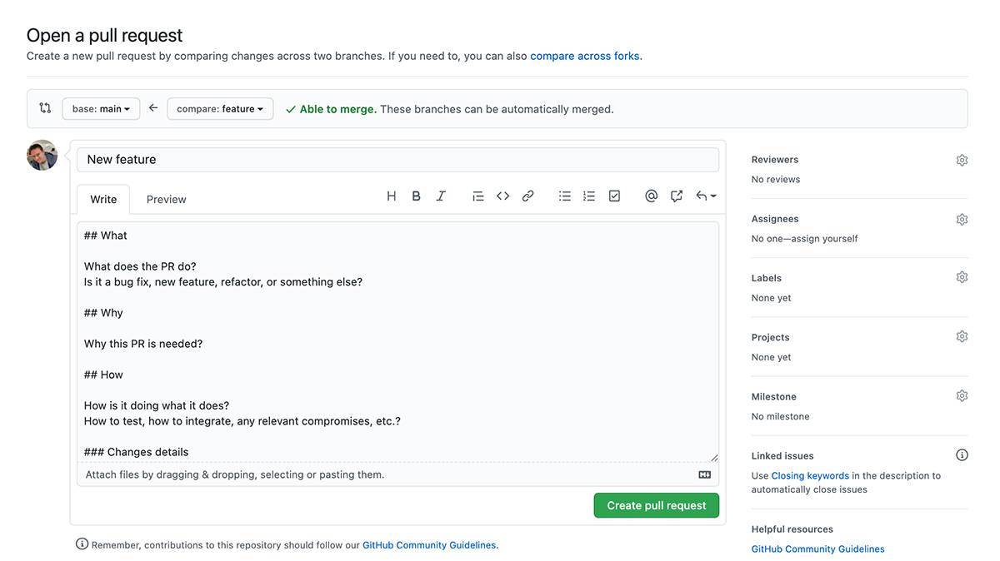
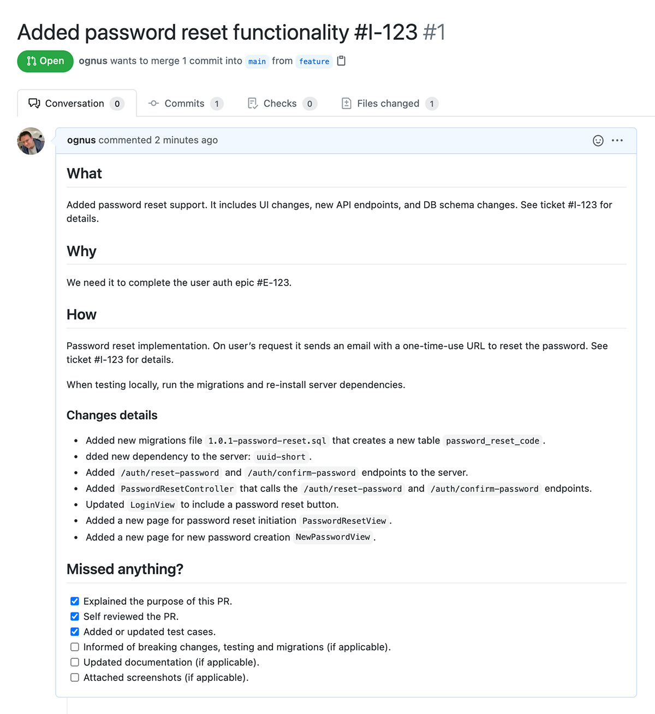

It feels great to finish a brand new feature or a tricky bug fix one worked so hard on. Meticulously polishing one’s code to finally submit a pull request (PR). But do we really care as much about the pull request itself as our amazing code? Often not, but I think we should!

## Why is making great pull requests useful?

If your pull request is correctly described, it's much easier for the reviewer to read and understand. Reviewing is actually pretty hard, so it’s really helpful if the pull request is prepared in an easy to follow way.

Ok, but why should you care you might ask? Well, great pull requests benefit the team, the project, and yourself as well. Here is why:

- You get the review back quicker.
- It’s much less likely your PR will be rejected or simply forgotten about.
- It’s much more likely any problem will get detected, saving you from a bug report a few days later.

Great pull requests save time and are a net positive to the overall codebase and product quality.

Ok, so how to make great pull requests? Start by making them smaller!

## Make pull requests small

Why? The answer is easy: short pull requests are quick to review. Large pull requests are harder to review because they often include multiple bug fixes or a mix of bug fixes with code refactoring, or code style changes.

Processing a sea of often complicated code is hard work. The longer the reviewer has to endure, the higher the chances of missing something. Because the reviewer’s cognitive capacity and time are finite, the review quality goes down with the increase of the pull request size. This often leads to big pull requests being haphazardly skimmed through rather than properly reviewed.

The problem becomes much more apparent on bigger codebases and especially in open-source projects with many contributors. Most maintainers have other jobs and might not have time to cover large or complex pull requests. So your large pull request might get straight out rejected or just left there, forgotten forever.

So make small pull requests to ensure that they do not require a long time and attention from a reviewer.

But how small should a small pull request be? A good rule of thumb is making a pull request about one thing only.

## Solve one thing at a time

If a pull request contains few bug fixes and even other unrelated changes like code refactor, it’s not only complicated to review but also tough to test.

But what if I already fixed a bug, refactored some code, and fixed some code style issues? - I hear you ask.

Well, it’s still best to split up this monstrous pull request into several smaller ones. One pull request for the bug fix only, another one including the code refactoring, and finally a third one just with the code style changes.

It sounds like a lot of work, but it’s not really that bad, once you get a handle on the process. When you’d separate your pull requests a few times, you’ll start thinking about it as you write your code. Eventually, you’ll develop a habit of making smaller, concise pull requests. This will make life so much easier for everyone involved 😉.

<!-- If you need help with that, check out my post on How to split up changes into multiple pull requests.  -->

Sidenote:

<Block tweetSlug={props.slug} tweetHashtags="programming, dev">
  It’s best to automate code style and formatting. Nothing is less productive
  than completely subjective discussions on code style happening in pull request
  comments.
</Block>

<!-- I have prepared a post on How to automate code linting and formatting using Github Actions, Prettier, and ESLint. -->

## Be descriptive

A pull request starts with a title. Make the title clear. It should be concise but self-explanatory. A person who just joined the project should be able to understand what the pull request is about.

For example: “Fixed navigation panel not being visible on a user's profile page” is a good title. However, these are not:

- “Fix: UI1-123”
- “UI Fixes”
- “Profile fix”
- “Navigation fix”

Besides a title, a good pull request description also goes a long way. The purpose of the description is to aid the reviewer. As a reviewer, I want to know what the pull request is about, why you have submitted it, and how it does what it is supposed to do. So I can understand the implications of merging this PR and how to verify if it works as expected.

So a good rule of thumb would be to cover:

- **what** the pull request is about,
- **why** you made it and
- **how** it does what it is supposed to do, detailing any design decisions, how it can be tested, or verified.

Let’s look into the **what**, **why**, and **how** in more detail.

### The What, Why and How

In the **What** section we can specify what the pull request does. It doesn’t have to be very detailed but should indicate if this is a new feature, bug fix, refactor, or something else.

It’s also very helpful to give a general overview of the scope of the changes. Things like which parts of the UI it changes, does it change the business logic in any way, introduces new API endpoints or data structures.

The **Why** should explain why you made this pull request. If it’s a bug fix, then it’s most likely obvious, but won’t hurt to mention how this fits into a bigger picture. For example, a performance improvement or architectural change might make a new feature possible or help solve other bugs.

Explaining the why is especially useful when contributing to open source projects or when the reason for a change is not immediately obvious, like when it’s somehow opinionated or a refactor.

The **How** is all about meaty details of your pull request.

Basically, anything that might help the reader to understand your thought process when making a particular change is helpful. This includes an explanation of any decisions or compromises you took, as well as, anything that helps the reviewer to verify if the change has been done correctly or even manually test your PR if needed.

For the same reason, when doing changes that impact UI, it’s helpful to include the “before” and “after” screenshots.

Pro tip:

<Block tweetSlug={props.slug} tweetHashtags="programming, dev">
  If the pull request makes a UI change, please include UI screenshots
  explaining that change. Those are life-savers. Screenshots make it much easier
  for the reviewer to understand and verify the change.
</Block>

Great! We now know what we can write in each section of our pull request description. Let’s create a template for it, so we can reuse it each time we submit a new pull request.

## Create Pull Request Template

Github allows us to create a pull request template, which will prefill a new pull request description with our structure and any additional details to guide the PR author in writing the description.

The great thing about pull request templates is that they are part of the repository so anyone who creates a pull request will get the description pre-populated from the same template. Perfect for teams and open source projects.

So to make everyone’s lives easier let’s try to create a pull request template.

We’ll write our template in a Markdown file and include it in the repository. You can put it in the root directory but I prefer to add it into a hidden `.github` directory:

```bash
├── .github
│   └── pull_request_template.md
└── ...
```

See the [Github docs](https://docs.github.com/articles/creating-a-pull-request-template-for-your-repository) for more details and options on how to create pull request templates.

As a matter of fact, the **what**, **why**, and **how** gives us a nice structure for the PR description template to start with. Each of them can be a heading, something like:

```markdown
## What

## Why

## How
```

Let me share a pull request template that I like to use. It also contains a “Missed anything?” section at the bottom for the PR authors to check if they didn’t miss anything important, like updating tests, attaching screenshots, etc.

```markdown
## What

What does the PR do?
Is it a bug fix, new feature, refactor, or something else?

## Why

Why this PR is needed?

## How

How is it doing what it does?
How to test, how to integrate, any relevant compromises, etc.?

### Changes details

- Detail one
- Detail two
  ...

## Missed anything?

- [ ] Explained the purpose of this PR.
- [ ] Self reviewed the PR.
- [ ] Added or updated test cases.
- [ ] Informed of breaking changes, testing and migrations (if applicable).
- [ ] Updated documentation (if applicable).
- [ ] Attached screenshots (if applicable).
```

That’s it! After you push the template file `.github/pull_request_template.md` to the Github repository, each time you make a new pull request, it’s description will be pre-filled with that template:



As the last thing, let’s have a look at an example of a great pull request.

## Example of a great pull request

To conclude, let’s use our new template and try to make a pull request that will hit all the marks we set for a great pull request. It should be small, about one thing and descriptive.

This pull request example is about adding password reset functionality to a web app. It’s a single feature, and even though the changes might span across multiple places of the app (client and server) the PR should be easy to review as we don’t include any unrelated changes like bug fixes or existing code refactoring.

Sidenote:

<Block tweetSlug={props.slug} tweetHashtags="programming, dev">
  Refactoring is a good practice and I strongly believe in leaving code better
  than you found it (as per the famous Boys Scout Rule from the Clean Code by
  Robert. C Martin), but try to make these changes in a separate PR.
</Block>



<!--
**Title**:
Added password reset functionality, #I-123

**Description**:

```markdown
## What

Added password reset support. It includes UI changes, new API endpoints, and DB schema changes. See ticket #I-123 for details.

## Why

We need it to complete the user auth epic #E-123.

## How

Password reset implementation. On user’s request it sends an email with a one-time-use URL to reset the password. See ticket #I-123 for details.

When testing locally, run the migrations and re-install server dependencies.

### Changes details

- Added new migrations file `1.0.1-password-reset.sql` that creates a new table `password_reset_code`.
- dded new dependency to the server: `uuid-short`.
- Added `/auth/reset-password` and `/auth/confirm-password` endpoints to the server.
- Added `PasswordResetController` that calls the `/auth/reset-password` and `/auth/confirm-password` endpoints.
- Updated `LoginView` to include a password reset button.
- Added a new page for password reset initiation `PasswordResetView`.
- Added a new page for new password creation `NewPasswordView`.

## Missed anything?

- [x] Explained the purpose of this PR.
- [x] Self reviewed the PR.
- [x] Added or updated test cases.
- [ ] Informed of breaking changes, testing and migrations (if applicable).
- [ ] Updated documentation (if applicable).
- [ ] Attached screenshots (if applicable).
``` -->

Let’s re-iterate! If you would like to always make great pull requests, make them with this in mind:

- Small PRs are better.
- PRs should be about one thing only.
- A clear, relevant, and detailed explanation of a PR is important.

It really makes a difference 😁 This way of writing PR made my life easier, both when making pull requests, as well as when reviewing someone else’s code.
